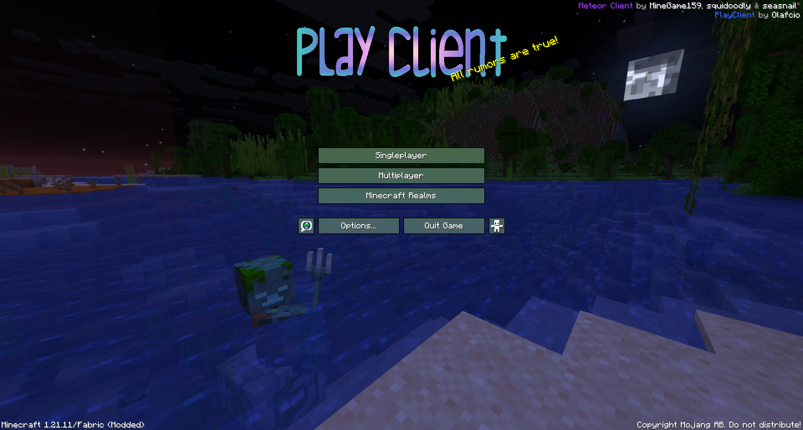
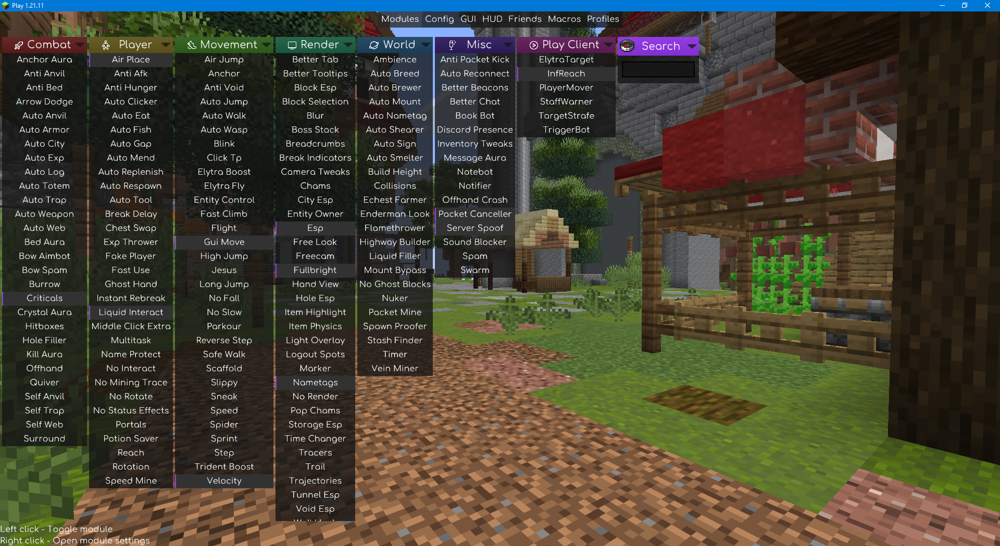

    

    
    
Or, alternatively, <a href="https://github.com/Olafcio1/PlayClient/raw/refs/heads/main/bin/PlayClient-nightly.jar">download the dev build</a>

<h1>🔰 PlayClient</h1>

Beautify. Improve. Repeat.

## 📺 Screenshots

## 🪶 Features
> **Note:** PlayClient is in preview. It is ready for production use, but may have significant changes once it's released.

<b>Modules:</b>

| Category        | Name           | Description                                                                 |
|-----------------|----------------|-----------------------------------------------------------------------------|
| Play Client     | StaffWarner    | warns you when a staff member is detected                                   |
| Play Client     | PlayerMover    | moves players when you hit them                                             |
| Play Client     | TargetStrafe   | strafes around players when you hit them                                    |
| Play Client     | ElytraTarget   | flies onto a player with elytra                                             |
| Play Client     | InfReach       | expands your reach infinitely by teleporting to the target for the hit-time |
| Play Client     | TriggerBot     | clicks on the entity you're looking at                                      |
| Play &gt; Grief | AutoCommandSet | automatically schedules the specified commands the best as it can           |                             |

<b>Commands:</b>

| Name   | Description                       |
|--------|-----------------------------------|
| Payall | splits your money per all players |

<b>Miscellaneous:</b>

| Type     | Name | Description                                                                |
|----------|------|----------------------------------------------------------------------------|
| Theme    | Play | a custom theme, having colorful module category headers with special icons |
| MC Theme | -    | Custom game logo, button backgrounds & mouse pointer on hover              |

## 📃 TODO
| Type   | Name         | Description                                                                 | Planned version |
|--------|--------------|-----------------------------------------------------------------------------|-----------------|
